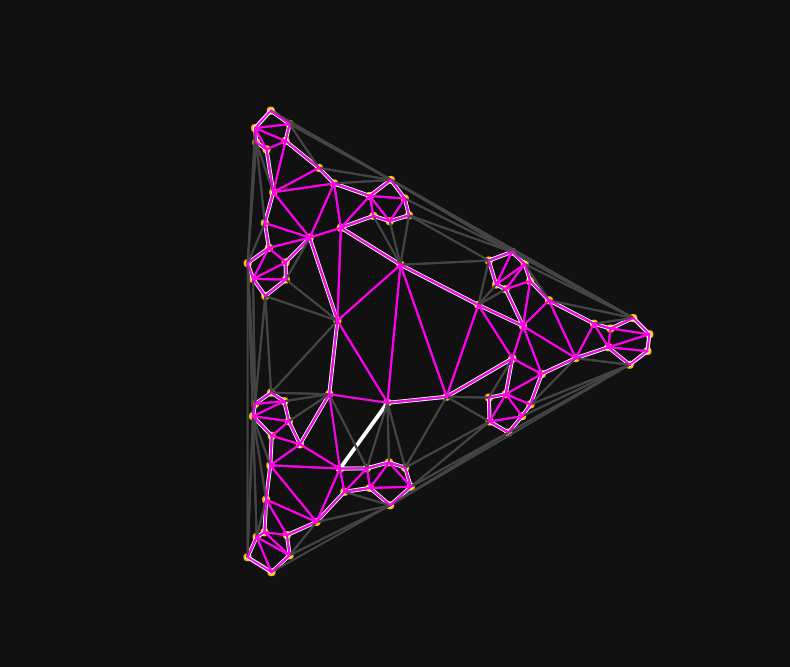

Test of generating triangle meshes from a closed polygon. The closed polygon is made
based on [Sierpinski triangle](https://en.wikipedia.org/wiki/Sierpi%C5%84ski_triangle).
To generate triangle meshes, I used [Delaunator](https://www.npmjs.com/package/delaunator). Delaunator generates meshes that are outside of the closed polygon. So I removed the triangles whose edges are outside of the closed polygon.

# Issue
There are cases the edges of generated triangles cross the edges of the closed polygon. Needs to be fixed if we make cleaner meshes.

